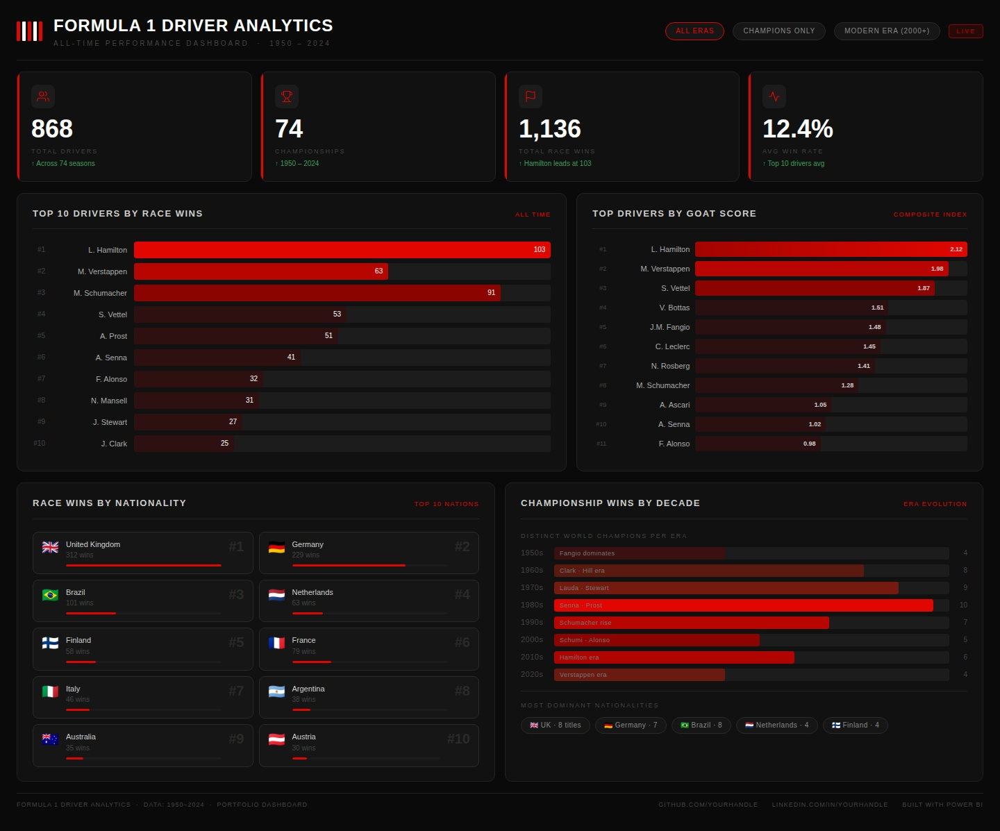

# 🏎️ Formula 1 Driver Analytics Dashboard

A portfolio-grade sports analytics project built using SQL, PostgreSQL, Excel, and Power BI to analyze Formula 1 driver dominance, championship trends, GOAT rankings, and historical performance evolution.

---

# 📊 Dashboard Preview



---

# 🎯 Project Objective

The goal of this project is to analyze historical Formula 1 driver data and uncover insights related to:

- Driver dominance
- Championship consistency
- GOAT ranking analysis
- Era-based performance evolution
- Nationality-based success trends
- Win efficiency and podium consistency

This project demonstrates end-to-end Data Analytics workflow including:
- SQL analysis
- Data cleaning
- KPI engineering
- Dashboard storytelling
- Data visualization

---

# 🛠️ Tech Stack

- SQL
- PostgreSQL
- Power BI
- Excel
- Data Visualization
- Sports Analytics

---

# 📁 Project Structure

```text
F1-Driver-Analytics/
│
├── Dashboard/
│   ├── F1_Dashboard.pbix
│   └── f1_dashboard.jpg
│
├── Dataset/
│   └── F1DriversDataset.csv
│
├── SQL/
│   ├── basic_analysis.sql
│   ├── intermediate_analysis.sql
│   └── advanced_analysis.sql
│
├── insights.md
└── README.md
```

---

# 🔍 SQL Analysis Performed

## Basic Analysis
- Top drivers by race wins
- Most successful nationalities
- Championship distribution by decade
- Driver consistency analysis
- Points efficiency analysis

## Intermediate Analysis
- Champion vs Non-Champion comparison
- Driver efficiency metrics
- Exceptional consistency analysis
- Decade-wise performance trends

## Advanced Analysis
- Custom GOAT Score model
- Driver tier classification
- Window function ranking analysis
- Historical dominance evaluation

---

# 🧠 Key Insights

- Lewis Hamilton leads Formula 1 history in total race wins.
- Championship success strongly correlates with podium consistency.
- Modern Formula 1 eras demonstrate higher scoring efficiency.
- British and German drivers historically dominated Formula 1 championships.
- A custom GOAT metric was developed using weighted performance indicators.

---

# 📈 Dashboard Features

- Executive KPI Overview
- GOAT Score Analysis
- Driver Dominance Rankings
- Championship Trends by Decade
- Nationality-Based Performance Analysis
- Interactive Power BI Dashboard

---

# 📌 Key KPIs

- Total Drivers
- Total Championships
- Total Race Wins
- Average Win Rate
- GOAT Score
- Podium Consistency

---

# 🚀 How to Run the Project

1. Clone the repository

```bash
git clone https://github.com/your-username/F1-Driver-Analytics.git
```

2. Open PostgreSQL and import the dataset

3. Run SQL scripts from the `SQL/` folder

4. Open the `.pbix` file in Power BI Desktop

5. Explore the dashboard interactively

---

# 📷 Dashboard Highlights

## 🏁 Driver Dominance Analysis
- Top Drivers by Race Wins
- GOAT Score Rankings
- Driver Efficiency Metrics

## 🌍 Nationality Analysis
- Most successful Formula 1 nations
- Race wins by nationality

## 📅 Historical Evolution
- Championship trends across decades
- Era-based performance analysis

---

# 🔮 Future Improvements

- Real-time Formula 1 API integration
- Predictive analytics using Python
- Driver performance forecasting
- Constructor/team analytics
- Interactive web dashboard deployment

---

# 👨‍💻 Author

Subham Nayak

Aspiring Data Analyst passionate about:
- Sports Analytics
- SQL
- Power BI
- Data Visualization
- Dashboard Engineering

---

# ⭐ If you liked this project

Give the repository a star ⭐
